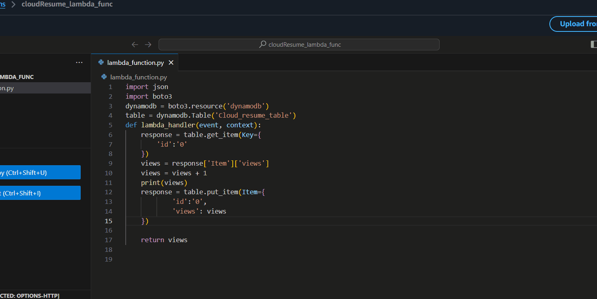

# 🚀 AWS Serverless Cloud Resume

Welcome to my advanced, fully serverless resume project showcasing modern cloud-native architecture on AWS. This project demonstrates technical expertise by leveraging serverless infrastructure to deliver a secure, performant, scalable resume website with dynamic viewer tracking.

## ⚠️ Important Notice:
Please note that the live AWS-hosted website for this project has been retired.
As a student, maintaining regular cloud costs outside the AWS Free Tier was not feasible.
However, the full project structure, deployment steps, and technical architecture remain available here on GitHub for learning and reference purposes.

---

## 📌 Overview

This project integrates front-end development with advanced AWS services to deploy a seamless, globally accessible resume website. Key highlights include:

- **Front-End Development**: HTML, CSS, and JavaScript for responsive, interactive user experience.
- **Static File Hosting**: Amazon S3 optimized with versioning and cost-efficient configuration.
- **Content Delivery Network (CDN)**: Amazon CloudFront set up to deliver content securely and efficiently over HTTPS.
- **Domain & DNS Management**: Namecheap domain integrated with AWS Route 53 for seamless DNS handling.
- **SSL/TLS Security**: AWS Certificate Manager (ACM) for provisioning and managing SSL certificates.
- **Dynamic Serverless Computing**: AWS Lambda integrated with DynamoDB for real-time user tracking.
- **Database Management**: DynamoDB deployed for lightweight, highly scalable tracking of visitor interactions.
- **Cost Monitoring**: CloudWatch Alarms implemented to monitor and alert on unexpected usage spikes and cost anomalies.

---

## 🛠️ Detailed Technical Architecture

### 1. Front-End Development
- Developed using HTML5, CSS3, and vanilla JavaScript.
- Responsive and optimized for performance.

### 2. Amazon S3 Static Hosting
- Utilized General-Purpose S3 bucket with versioning enabled for robust data management.
- Configured bucket policies for secure, controlled public access.

### 3. CloudFront CDN Configuration
- Set up CloudFront using the REST API endpoint of S3 for secure HTTPS content delivery.
- Optimized caching policies for cost efficiency and fast global content delivery, specifically fine-tuned for cost-effective performance in targeted regions.

### 4. DNS and Domain Setup
- Domain purchased from Namecheap.
- Managed DNS via AWS Route 53, with NS, SOA, and CNAME records correctly configured for efficient domain resolution and global availability.

### 5. SSL/TLS Certificate Provisioning
- SSL certificates provisioned through AWS Certificate Manager (ACM).
- Domain validation via DNS integration with Route 53 ensuring secure HTTPS traffic.

### 6. Serverless Back-End with AWS Lambda & DynamoDB
- Lambda functions developed with IAM roles for secure, controlled access to DynamoDB.
- DynamoDB integrated to dynamically store, update, and retrieve visitor metrics (page views).

### 7. Cost Monitoring with AWS CloudWatch
- Implemented CloudWatch Alarms to proactively monitor resource usage and manage costs.
- Configured alerts to handle unexpected activity or increased expenses promptly.

---

## 🖼️ Snapshot

--- 

## 🚩 Deployment Steps

### Front-End Development & Hosting
- Develop the website using HTML, CSS, and JavaScript.
- Upload to Amazon S3 bucket configured for static hosting and versioning.

### CloudFront CDN Setup
- Deploy CloudFront distribution linked to S3 REST API endpoint.
- Enforce HTTPS, define caching behaviors, and apply optimized security settings.

### Domain & DNS Configuration
- Purchase domain via Namecheap.
- Configure Route 53 with Namecheap domain using NS, SOA, and CNAME records.
- Link custom domain to CloudFront distribution.

### SSL Certificate Setup
- Request SSL certificates using AWS ACM.
- Validate via Route 53 DNS entries.

### Serverless Functionality
- Deploy AWS Lambda functions with proper IAM permissions.
- Integrate DynamoDB for real-time data interactions.

### Monitoring and Alerting
- Configure CloudWatch Alarms for monitoring costs and traffic.

---

## 📈 Results

- Achieved fully automated, highly available serverless architecture.
- Provided robust user tracking with DynamoDB.
- Maintained optimal cost-efficiency via proactive CloudWatch monitoring.

---

